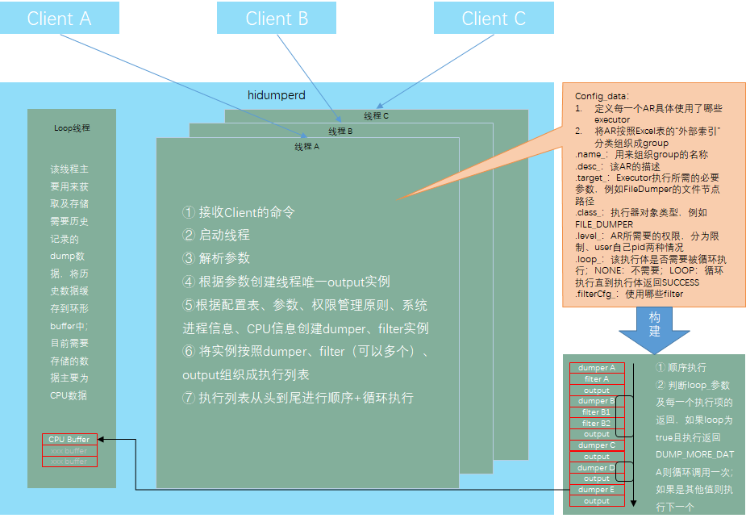
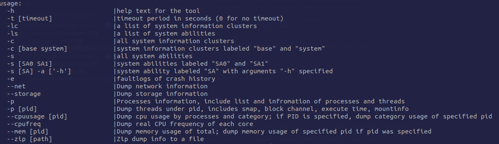

# HiDumper<a name="EN-US_TOPIC_0000001116225437"></a>

- [HiDumper<a name="EN-US_TOPIC_0000001116225437"></a>](#hidumper)
  - [Introduction<a name="section11660541593"></a>](#introduction)
  - [Directory Structure<a name="section161941989596"></a>](#directory-structure)
  - [Description<a name="section1312121216216"></a>](#description)
    - [Command Description<a name="section1551164914237"></a>](#command-description)
    - [Usage<a name="section129654513264"></a>](#usage)
  - [Repositories Involved<a name="section1371113476307"></a>](#repositories-involved)

-   [Repositories Involved](#section1371113476307)

## Introduction<a name="section11660541593"></a>

HiDumper is a unified system information collection tool provided for development and test personnel to analyze and locate faults.

HiDumper consists of the following modules:

-   DumpManager: Serves as the manager of HiDumper, which provides functions such as information classification, command request distribution, and information collection.
-   DumpController: Serves as the controller of HiDumper, which provides functions such as tool help, as well as parameter parsing, verification, and distribution.
-   Dumpers: Exports various information.

**Figure 1**  Architecture of HiDumper



## Directory Structure<a name="section161941989596"></a>

```
/base/hiviewdfx/hidumper
├── client                # Hidumper client code
│   ├── native            # Native client code
├── frameworks            # Framework code
│   ├── native            # HiDumper core code
|   |   |── inlude        # Header files of native
|   |   |── src           # Common source code folder
|   |       |── common    # Common source code
|   |       |── executor  # Executor units for dump
|   |       |── factory   # Facotries to create concrete dumpers                   # Code to dump information
|   |       |── manager   # Code to manage dump process
|   |       |── util      # File or commands operation utils
|── sa_profile            # Profile to make hidumper as an sa
|── services              # Hidumper service code
|   |── native            # Native code
|   |── zidl              # Communication code of service
|   |   |── include       # Include file
|   |   |── src           # Communication code of service
├── test                  # Test cases
│   ├── unittest          # Unit test code
│   ├── moduletest        # Module-level test code
```

## Description<a name="section1312121216216"></a>

During OpenHarmony application development, you can use HiDumper to query system information, service information, and process stack information, and then use the information to analyze and locate faults.

### Command Description<a name="section1551164914237"></a>

Go to the  **shell**  command window and run the  **hidumper**  command with related options specified.



<a name="table126331110122110"></a>
<table><tbody><tr id="row57061210192111"><td class="cellrowborder" valign="top" width="20.44%"><p id="p27061102216"><a name="p27061102216"></a><a name="p27061102216"></a>Option</p>
</td>
<td class="cellrowborder" valign="top" width="79.56%"><p id="p17706121014217"><a name="p17706121014217"></a><a name="p17706121014217"></a>Description</p>
</td>
</tr>
<tr id="row11706310142113"><td class="cellrowborder" valign="top" width="20.44%"><p id="p97061710132117"><a name="p97061710132117"></a><a name="p97061710132117"></a>-h</p>
</td>
<td class="cellrowborder" valign="top" width="79.56%"><p id="p3706510162119"><a name="p3706510162119"></a><a name="p3706510162119"></a>Help information.</p>
</td>
</tr>
<tr id="row77061310192110"><td class="cellrowborder" valign="top" width="20.44%"><p id="p27062010112111"><a name="p27062010112111"></a><a name="p27062010112111"></a>-t timeout</p>
</td>
<td class="cellrowborder" valign="top" width="79.56%"><p id="p2706111016219"><a name="p2706111016219"></a><a name="p2706111016219"></a>Timeout interval, in seconds. The default value is <strong id="b99621025549"><a name="b99621025549"></a><a name="b99621025549"></a>30</strong>. Value <strong id="b234351914547"><a name="b234351914547"></a><a name="b234351914547"></a>0</strong> indicates no timeout limit.</p>
</td>
</tr>
<tr id="row270661092112"><td class="cellrowborder" valign="top" width="20.44%"><p id="p8706131020213"><a name="p8706131020213"></a><a name="p8706131020213"></a>-lc</p>
</td>
<td class="cellrowborder" valign="top" width="79.56%"><p id="p11706610152113"><a name="p11706610152113"></a><a name="p11706610152113"></a>List of system information clusters.</p>
</td>
</tr>
<tr id="row20706131017216"><td class="cellrowborder" valign="top" width="20.44%"><p id="p57061110192115"><a name="p57061110192115"></a><a name="p57061110192115"></a>-ls</p>
</td>
<td class="cellrowborder" valign="top" width="79.56%"><p id="p107061110142112"><a name="p107061110142112"></a><a name="p107061110142112"></a>List of system abilities.</p>
</td>
</tr>
<tr id="row147066101217"><td class="cellrowborder" valign="top" width="20.44%"><p id="p170641092110"><a name="p170641092110"></a><a name="p170641092110"></a>-c</p>
</td>
<td class="cellrowborder" valign="top" width="79.56%"><p id="p1170712101218"><a name="p1170712101218"></a><a name="p1170712101218"></a>All system information clusters.</p>
</td>
</tr>
<tr id="row1370761072115"><td class="cellrowborder" valign="top" width="20.44%"><p id="p3707181012215"><a name="p3707181012215"></a><a name="p3707181012215"></a>-c [base system]</p>
</td>
<td class="cellrowborder" valign="top" width="79.56%"><p id="p8707510142117"><a name="p8707510142117"></a><a name="p8707510142117"></a>System information clusters labeled <strong id="b2017612014568"><a name="b2017612014568"></a><a name="b2017612014568"></a>base</strong> and <strong id="b197788595614"><a name="b197788595614"></a><a name="b197788595614"></a>system</strong>.</p>
</td>
</tr>
<tr id="row1470741092110"><td class="cellrowborder" valign="top" width="20.44%"><p id="p270711012217"><a name="p270711012217"></a><a name="p270711012217"></a>-s</p>
</td>
<td class="cellrowborder" valign="top" width="79.56%"><p id="p207072100218"><a name="p207072100218"></a><a name="p207072100218"></a>All system abilities.</p>
</td>
</tr>
<tr id="row87079101213"><td class="cellrowborder" valign="top" width="20.44%"><p id="p1757192212613"><a name="p1757192212613"></a><a name="p1757192212613"></a>-s [SA0 SA1]</p>
</td>
<td class="cellrowborder" valign="top" width="79.56%"><p id="p1179714331667"><a name="p1179714331667"></a><a name="p1179714331667"></a>System abilities labeled <strong id="b12541172585617"><a name="b12541172585617"></a><a name="b12541172585617"></a>SA0</strong> and <strong id="b571373112567"><a name="b571373112567"></a><a name="b571373112567"></a>SA1</strong>.</p>
</td>
</tr>
<tr id="row2707141012213"><td class="cellrowborder" valign="top" width="20.44%"><p id="p1670731002117"><a name="p1670731002117"></a><a name="p1670731002117"></a>-s [SA] -a ['-h']</p>
</td>
<td class="cellrowborder" valign="top" width="79.56%"><p id="p1707910172115"><a name="p1707910172115"></a><a name="p1707910172115"></a>System abilities labeled <strong id="b19133165255614"><a name="b19133165255614"></a><a name="b19133165255614"></a>SA</strong> with argument <strong id="b1764485819565"><a name="b1764485819565"></a><a name="b1764485819565"></a>-h</strong> specified.</p>
</td>
</tr>
<tr id="row2708572563983"><td class="cellrowborder" valign="top" width="20.44%"><p id="p8829685199862"><a name="p8829685199862"></a><a name="p8829685199862"></a>-e</p>
</td>
<td class="cellrowborder" valign="top" width="79.56%"><p id="p13829472934298"><a name="p13829472934298"></a><a name="p13829472934298"></a>faultlogs of crash history</p>
</td>
</tr>
<tr id="row2708284623764"><td class="cellrowborder" valign="top" width="20.44%"><p id="p2847273496279"><a name="p2847273496279"></a><a name="p2847273496279"></a>--net</p>
</td>
<td class="cellrowborder" valign="top" width="79.56%"><p id="p28472974923438"><a name="p28472974923438"></a><a name="p28472974923438"></a>Dump network information</p>
</td>
</tr>
<tr id="row2709983759832"><td class="cellrowborder" valign="top" width="20.44%"><p id="p8347293742986"><a name="p8347293742986"></a><a name="p8347293742986"></a>--storage</p>
</td>
<td class="cellrowborder" valign="top" width="79.56%"><p id="p83247298374873"><a name="p83247298374873"></a><a name="p83247298374873"></a>Dump storage information</p>
</td>
</tr>
<tr id="row2708928742896"><td class="cellrowborder" valign="top" width="20.44%"><p id="p8972398599875"><a name="p8972398599875"></a><a name="p8972398599875"></a>-p</p>
</td>
<td class="cellrowborder" valign="top" width="79.56%"><p id="p28472923948205"><a name="p28472923948205"></a><a name="p28472923948205"></a>Processes information, include list and infromation of process and threads</p>
</td>
</tr>
<tr id="row82376428786"><td class="cellrowborder" valign="top" width="20.44%"><p id="p2847283648293"><a name="p2847283648293"></a><a name="p2847283648293"></a>-p [pid]</p>
</td>
<td class="cellrowborder" valign="top" width="79.56%"><p id="p1137324628378"><a name="p1137324628378"></a><a name="p1137324628378"></a>Dump threads under <strong id="b12427364827328"><a name="b12427364827328"></a><a name="b12427364827328"></a>pid</strong>, includes smap, block channel, execute time, mountinfo.</p>
</td>
</tr>
<tr id="row2702394829379"><td class="cellrowborder" valign="top" width="20.44%"><p id="p9234728374296"><a name="p9234728374296"></a><a name="p9234728374296"></a>--cpuusage [pid]</p>
</td>
<td class="cellrowborder" valign="top" width="79.56%"><p id="p39857294862960"><a name="p39857294862960"></a><a name="p39857294862960"></a>Dump cpu usage by processes and category; if <strong id="b24376428727689"><a name="b24376428727689"></a><a name="b24376428727689"></a>pid</strong> is specified, dump category usage of specified <strong id="b24872934798426"><a name="b24872934798426"></a><a name="b24872934798426"></a>pid</strong></p>
</td>
</tr>
<tr id="row2795847597996"><td class="cellrowborder" valign="top" width="20.44%"><p id="p9498723847293"><a name="p9498723847293"></a><a name="p9498723847293"></a>--cpufreq</p>
</td>
<td class="cellrowborder" valign="top" width="79.56%"><p id="p98573498572696"><a name="p98573498572696"></a><a name="p98573498572696"></a>Dump real CPU frequency of each core</p>
</td>
</tr>
<tr id="row2334234887689"><td class="cellrowborder" valign="top" width="20.44%"><p id="p8573945739459"><a name="p8573945739459"></a><a name="p8573945739459"></a>--mem [pid]</p>
</td>
<td class="cellrowborder" valign="top" width="79.56%"><p id="p89427384923875"><a name="p89427384923875"></a><a name="p89427384923875"></a>Dump memory usage of total; dump memory usage of specified pid if <strong id="b28472837408372"><a name="b28472837408372"></a><a name="b28472837408372"></a>pid</strong> was specified</p>
</td>
</tr>
<tr id="row2834728379263"><td class="cellrowborder" valign="top" width="20.44%"><p id="p8234729837492"><a name="p8234729837492"></a><a name="p8234729837492"></a>--zip [path]</p>
</td>
<td class="cellrowborder" valign="top" width="79.56%"><p id="p89427384923875"><a name="p89427384923875"></a><a name="p89427384923875"></a>Zip dump info to a file</p>
</td>
</tr>
</tbody>
</table>

### Usage<a name="section129654513264"></a>

HiDumper helps you export basic system information to locate and analyze faults. When passing complex parameters to abilities, enclose parameters in double quotation marks.

The operation procedure is as follows:

1.  Access the device CLI, and run the  **hidumper -h**  command to obtain the help information, which includes basic information and function syntax.

    ```
    hidumper -h
    ```

2.  Run the  **hidumper -lc**  command to obtain a list of system information clusters.

    ```
    hidumper -lc
    ```

3.  Run the  **hidumper -c**  command to obtain system information clusters incluede  **base** and  **system** .

    ```
    hidumper -c
    ```

4.  Run the  **hidumper -c [base system]**  command to obtain system information clusters labeled  **base** or **system** .

    ```
    hidumper -c base
    hidumper -c system
    ```

5.  Run the  **hidumper -ls**  command to obtain a list of system abilities.

    ```
    hidumper -ls
    ```

6.  Run the  **hidumper -s**  command to obtain all system abilities.

    ```
    hidumper -s
    ```

7.  Run the  **hidumper -s 401 -a "-h"**  command to obtain the help information about the ability whose ID is  **401**.

    ```
    hidumper -s 401 -a "-h"
    ```

8.  Run the  **hidumper -s 401 -a**  command to obtain complete information about the ability whose ID is  **401**.

    ```
    hidumper -s 401 -a
    ```

9.  Run the  **hidumper -e**  command to obtain faultlog dump files of crash history.

    ```
    hidumper -e
    ```

10. Run the  **hidumper --net**  command to obtain network information.

    ```
    hidumper --net
    ```

11. Run the  **hidumper --storage**  command to obtain storage information.

    ```
    hidumper --storage
    ```

12. Run the  **hidumper --storage**  command to obtain storage information.

    ```
    hidumper --storage
    ```

13. Run the  **hidumper -p**  command to obtain processes information, include list and infromation of processes and threads.

    ```
    hidumper -p
    ```

14. Run the  **hidumper -p 1024**  command to obtain processes information which pid is 1024, includes infromation of processes.

    ```
    hidumper -p 1024
    ```

15. Run the  **--cpuusage [pid]**  command to obtain cpu usage by processes and category; if PID is specified, dump category usage of specified pid.

    ```
    hidumper --cpuusage
    hidumper --cpuusage 1024
    ```

16. Run the  **hidumper --cpufreq**  command to obtain real CPU frequency of each core.

    ```
    hidumper --cpufreq
    ```

17. Run the  **hidumper --mem [pid]**  command to obtain memory usage of total; to obtain memory usage of specified pid if pid was specified.

    ```
    hidumper --mem
    hidumper --mem 1024
    ```

18. Run the  **hidumper --zip [path]**  command to zip information into a specified path.

    ```
    hidumper --zip data/temp
    ```

19. Run the  **hidumper -t [timeout]**  command to set timeout of a dump group in seconds.

    ```
    hidumper -t 5
    ```


## Repositories Involved<a name="section1371113476307"></a>

DFX subsystem:

hmf/hiviewdfx

DFX repositories:

hmf/hiviwdfx/hilog

hmf/hiviwdfx/hitrace

hmf/hiviwdfx/hicollie

**hmf/hiviwdfx/hidumper**

hmf/hiviwdfx/hiappevent

hmf/hiviwdfx/hisysevent

hmf/hiviwdfx/debug

