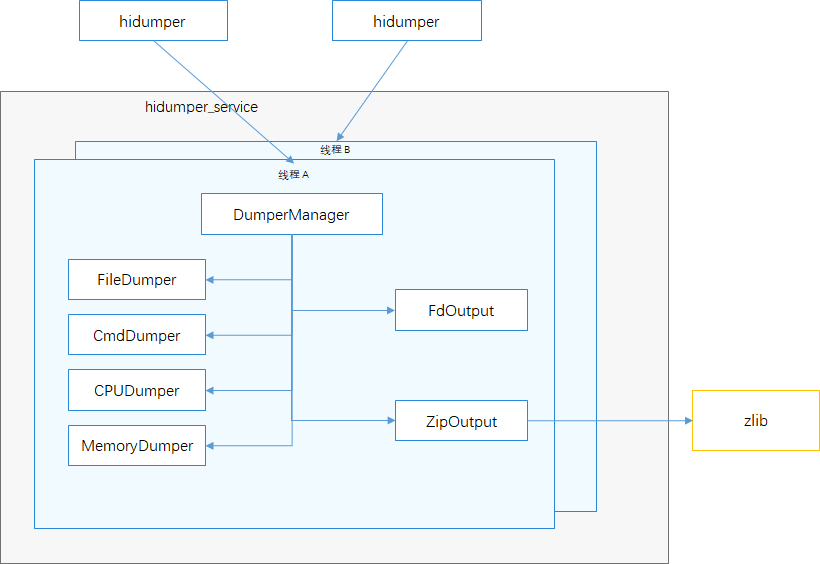

# HiDumper组件<a name="ZH-CN_TOPIC_0000001116225437"></a>

																  
- [HiDumper组件<a name="ZH-CN_TOPIC_0000001116225437"></a>](#hidumper组件)
  - [简介<a name="section11660541593"></a>](#简介)
  - [目录<a name="section161941989596"></a>](#目录)
  - [说明<a name="section1312121216216"></a>](#说明)
    - [接口说明<a name="section1551164914237"></a>](#接口说明)
    - [使用说明<a name="section129654513264"></a>](#使用说明)
  - [相关仓<a name="section1371113476307"></a>](#相关仓)
																					  

-   [相关仓](#section1371113476307)

## 简介<a name="section11660541593"></a>

HiDumper是OpenHarmony中为开发、测试人员，IDE工具提供统一的系统信息获取工具，帮助使用者分析，定位问题。

HiDumper主要包括以下几个主要模块：

-   hidumper，hidumper工具的可执行程序，接收用户输入，与服务端通讯
-   hidumperd，
-   DumpManager，系统信息导出工具管理者，提供信息分类，命令请求分发和信息获取方法的管理。
-   Dumpers，各类信息的导出器。主要包括文件导出、命令导出、CPU使用导出、内存使用导出等
-   Output，内容输出，主要包括向标准输出或文件输出的FdOutput，压缩输出的ZipOutput

**图1**  HiDumper架构图



## 目录<a name="section161941989596"></a>

```
/base/hiviewdfx/hidumper
├── client                # 客户端代码
│   ├── native            # 客户端native代码
├── frameworks            # 框架代码
│   ├── native            # 导出功能核心代码
|   |   |── inlude        # 头文件目录
|   |   |── src           # 源文件目录
|   |       |── common    # 通用功能代码
|   |       |── executor  # 导出过程执行器代码
|   |       |── factory   # 跟进导出项生成导出执行器
|   |       |── manager   # 导出管理核心代码
|   |       |── util      # 工具类源代码
|── sa_profile            # Hidumper sa 属性文件
|── services              # Hidumper服务源码
|   |── native            # 服务C++源码
|   |── zidl              # 通讯功能源码目录
|   |   |── include       # 通讯功能头文件
|   |   |── src           # 通讯功能源代码
├── test                  # 测试用例目录
│   ├── unittest          # 单元测试代码
│   ├── moduletest        # 模块级别测试代码
```

## 说明<a name="section1312121216216"></a>

开发者在OpenHarmony应用开发过程中需要查询系统信息，服务信息，进程栈等信息时可以通过HiDumper获取到对应信息，然后利用这些信息分析定位问题。

### 接口说明<a name="section1551164914237"></a>

进入shell命令窗口，执行hidumper命令，带上相关选项和参数即可。


<a name="table126331110122110"></a>
<table><tbody><tr id="row57061210192111"><td class="cellrowborder" valign="top" width="20.44%"><p id="p27061102216"><a name="p27061102216"></a><a name="p27061102216"></a>选项</p>
</td>
<td class="cellrowborder" valign="top" width="79.56%"><p id="p17706121014217"><a name="p17706121014217"></a><a name="p17706121014217"></a>描述</p>
</td>
</tr>
<tr id="row11706310142113"><td class="cellrowborder" valign="top" width="20.44%"><p id="p97061710132117"><a name="p97061710132117"></a><a name="p97061710132117"></a>-h</p>
</td>
<td class="cellrowborder" valign="top" width="79.56%"><p id="p3706510162119"><a name="p3706510162119"></a><a name="p3706510162119"></a>帮助信息</p>
</td>
</tr>
<tr id="row77061310192110"><td class="cellrowborder" valign="top" width="20.44%"><p id="p27062010112111"><a name="p27062010112111"></a><a name="p27062010112111"></a>-t timeout</p>
</td>
<td class="cellrowborder" valign="top" width="79.56%"><p id="p2706111016219"><a name="p2706111016219"></a><a name="p2706111016219"></a>超时时间，单位：秒。默认值是30s。如果设置为0表示无超时限定。</p>
</td>
</tr>
<tr id="row270661092112"><td class="cellrowborder" valign="top" width="20.44%"><p id="p8706131020213"><a name="p8706131020213"></a><a name="p8706131020213"></a>-lc</p>
</td>
<td class="cellrowborder" valign="top" width="79.56%"><p id="p11706610152113"><a name="p11706610152113"></a><a name="p11706610152113"></a>系统信息簇列表</p>
</td>
</tr>
<tr id="row20706131017216"><td class="cellrowborder" valign="top" width="20.44%"><p id="p57061110192115"><a name="p57061110192115"></a><a name="p57061110192115"></a>-ls</p>
</td>
<td class="cellrowborder" valign="top" width="79.56%"><p id="p107061110142112"><a name="p107061110142112"></a><a name="p107061110142112"></a>系统元能力列表</p>
</td>
</tr>
<tr id="row147066101217"><td class="cellrowborder" valign="top" width="20.44%"><p id="p170641092110"><a name="p170641092110"></a><a name="p170641092110"></a>-c</p>
</td>
<td class="cellrowborder" valign="top" width="79.56%"><p id="p1170712101218"><a name="p1170712101218"></a><a name="p1170712101218"></a>导出系统簇信息</p>
</td>
</tr>
<tr id="row1370761072115"><td class="cellrowborder" valign="top" width="20.44%"><p id="p3707181012215"><a name="p3707181012215"></a><a name="p3707181012215"></a>-c [base system]</p>
</td>
<td class="cellrowborder" valign="top" width="79.56%"><p id="p8707510142117"><a name="p8707510142117"></a><a name="p8707510142117"></a>以base或system标签区分的系统簇信息导出</p>
</td>
</tr>
<tr id="row1470741092110"><td class="cellrowborder" valign="top" width="20.44%"><p id="p270711012217"><a name="p270711012217"></a><a name="p270711012217"></a>-s</p>
</td>
<td class="cellrowborder" valign="top" width="79.56%"><p id="p207072100218"><a name="p207072100218"></a><a name="p207072100218"></a>导出全部系统源能力信息</p>
</td>
</tr>
<tr id="row87079101213"><td class="cellrowborder" valign="top" width="20.44%"><p id="p1757192212613"><a name="p1757192212613"></a><a name="p1757192212613"></a>-s [SA0 SA1]</p>
</td>
<td class="cellrowborder" valign="top" width="79.56%"><p id="p1179714331667"><a name="p1179714331667"></a><a name="p1179714331667"></a>导出SA0、SA1等元能力id对应的元能力信息</p>
</td>
</tr>
<tr id="row2707141012213"><td class="cellrowborder" valign="top" width="20.44%"><p id="p1670731002117"><a name="p1670731002117"></a><a name="p1670731002117"></a>-s [SA] -a ['-h']</p>
</td>
<td class="cellrowborder" valign="top" width="79.56%"><p id="p1707910172115"><a name="p1707910172115"></a><a name="p1707910172115"></a>以-h为参数导出SA指定的系统元能力信息</p>
</td>
</tr>
<tr id="row2708572563983"><td class="cellrowborder" valign="top" width="20.44%"><p id="p8829685199862"><a name="p8829685199862"></a><a name="p8829685199862"></a>-e</p>
</td>
<td class="cellrowborder" valign="top" width="79.56%"><p id="p13829472934298"><a name="p13829472934298"></a><a name="p13829472934298"></a>导出Faultlog模块生成的崩溃日志</p>
</td>
</tr>
<tr id="row2708284623764"><td class="cellrowborder" valign="top" width="20.44%"><p id="p2847273496279"><a name="p2847273496279"></a><a name="p2847273496279"></a>--net</p>
</td>
<td class="cellrowborder" valign="top" width="79.56%"><p id="p28472974923438"><a name="p28472974923438"></a><a name="p28472974923438"></a>导出网络信息</p>
</td>
</tr>
<tr id="row2709983759832"><td class="cellrowborder" valign="top" width="20.44%"><p id="p8347293742986"><a name="p8347293742986"></a><a name="p8347293742986"></a>--storage</p>
</td>
<td class="cellrowborder" valign="top" width="79.56%"><p id="p83247298374873"><a name="p83247298374873"></a><a name="p83247298374873"></a>导出存储信息</p>
</td>
</tr>
<tr id="row2708928742896"><td class="cellrowborder" valign="top" width="20.44%"><p id="p8972398599875"><a name="p8972398599875"></a><a name="p8972398599875"></a>-p</p>
</td>
<td class="cellrowborder" valign="top" width="79.56%"><p id="p28472923948205"><a name="p28472923948205"></a><a name="p28472923948205"></a>导出进程列表及全部进程信息</p>
</td>
</tr>
<tr id="row82376428786"><td class="cellrowborder" valign="top" width="20.44%"><p id="p2847283648293"><a name="p2847283648293"></a><a name="p2847283648293"></a>-p [pid]</p>
</td>
<td class="cellrowborder" valign="top" width="79.56%"><p id="p1137324628378"><a name="p1137324628378"></a><a name="p1137324628378"></a>导出指定进程号的进程全部信息</p>
</td>
</tr>
<tr id="row2702394829379"><td class="cellrowborder" valign="top" width="20.44%"><p id="p9234728374296"><a name="p9234728374296"></a><a name="p9234728374296"></a>--cpuusage [pid]</p>
</td>
<td class="cellrowborder" valign="top" width="79.56%"><p id="p39857294862960"><a name="p39857294862960"></a><a name="p39857294862960"></a>导出CPU使用信息；如果指定pid则导出该进程的CPU使用信息</p>
</td>
</tr>
<tr id="row2795847597996"><td class="cellrowborder" valign="top" width="20.44%"><p id="p9498723847293"><a name="p9498723847293"></a><a name="p9498723847293"></a>--cpufreq</p>
</td>
<td class="cellrowborder" valign="top" width="79.56%"><p id="p98573498572696"><a name="p98573498572696"></a><a name="p98573498572696"></a>导出实际的CPU频率</p>
</td>
</tr>
<tr id="row2334234887689"><td class="cellrowborder" valign="top" width="20.44%"><p id="p8573945739459"><a name="p8573945739459"></a><a name="p8573945739459"></a>--mem [pid]</p>
</td>
<td class="cellrowborder" valign="top" width="79.56%"><p id="p89427384923875"><a name="p89427384923875"></a><a name="p89427384923875"></a>导出内存使用信息；如果指定pid则导出该进程的内存使用信息</p>
</td>
</tr>
<tr id="row2834728379263"><td class="cellrowborder" valign="top" width="20.44%"><p id="p8234729837492"><a name="p8234729837492"></a><a name="p8234729837492"></a>--zip [path]</p>
</td>
<td class="cellrowborder" valign="top" width="79.56%"><p id="p89427384923875"><a name="p89427384923875"></a><a name="p89427384923875"></a>将导出信息压缩到指定文件</p>
</td>
</tr>
</tbody>
</table>

### 使用说明<a name="section129654513264"></a>

hidumper可以为开发者导出系统当前基本信息，通过这些基本信息可以定位分析问题。给子服务和元能力传递复杂参数时，参数需要在双引号中。

具体步骤如下：

1.  进入设备命令行，输入hidumper -h获取基本信息介绍，功能语法介绍。

    ```
    hidumper -h显示帮助信息
    ```

2.  输入hidumper -lc获取系统信息分类列表。

    ```
    hidumper -lc
    ```

3.  输入hidumper -c base获取系统base信息。

    ```
    hidumper -c
    ```

4.  输入  **hidumper -c [base system]**  按  **base** 或 **system** 分类获取系统簇信息

    ```
    hidumper -c base
    hidumper -c system
    ```

5.  输入  **hidumper -ls**  命令获取系统中元能力列表

    ```
    hidumper -ls
    ```

6.  输入  **hidumper -s**  命令获取系统全部元能力信息

    ```
    hidumper -s
    ```

7.  运行  **hidumper -s 401 -a "-h"**  命令获取id为401的元能力的帮助

    ```
    hidumper -s 401 -a "-h"
    ```

8.  运行  **hidumper -s 401 -a**  命令获取id为401的元能力的全部信息

    ```
    hidumper -s 401 -a
    ```

9.  运行  **hidumper -e**  命令获取Faultlog模块生成的崩溃历史信息

    ```
    hidumper -e
    ```

10. 运行  **hidumper --net**  命令获取网络信息

    ```
    hidumper --net
    ```

11. 运行  **hidumper --storage**  命令获取存储相关信息

    ```
    hidumper --storage
    ```
12. 运行  **hidumper -p**  命令获取进程信息，包括进程、线程的列表和信息

    ```
    hidumper -p
    ```

13. 运行  **hidumper -p 1024**  命令获取pid为1024的进程信息

    ```
    hidumper -p 1024
    ```

14. 运行  **hidumper --cpuusage [pid]**  命令获取CPU的使用信息；如果指定了进程的pid，则只获取该进程的CPU使用信息

    ```
    hidumper --cpuusage
    hidumper --cpuusage 1024
    ```

15. 运行  **hidumper --cpufreq**  命令获取每一个CPU核实际运行的频率

    ```
    hidumper --cpufreq
    ```

16. 运行  **hidumper --mem [pid]**  命令获取全部的内存使用信息；如果指定进程的pid，只获取该进程的内存使用情况

    ```
    hidumper --mem
    hidumper --mem 1024
    ```

17. 运行  **hidumper --zip path**  命令压缩信息数据到一个path指定的文件

    ```
    hidumper --zip data/temp
    ```

18. 运行  **hidumper -t timeout**  命令设置超时时间，单位：秒。默认值是30s。如果设置为0表示无超时限定。

    ```
    hidumper -t 5
    ```


## 相关仓<a name="section1371113476307"></a>

DFX子系统:

hmf/hiviewdfx

DFX组件:

hmf/hiviwdfx/hilog

hmf/hiviwdfx/hitrace

hmf/hiviwdfx/hicollie

**hmf/hiviwdfx/hidumper**

hmf/hiviwdfx/hiappevent

hmf/hiviwdfx/hisysevent

hmf/hiviwdfx/debug
